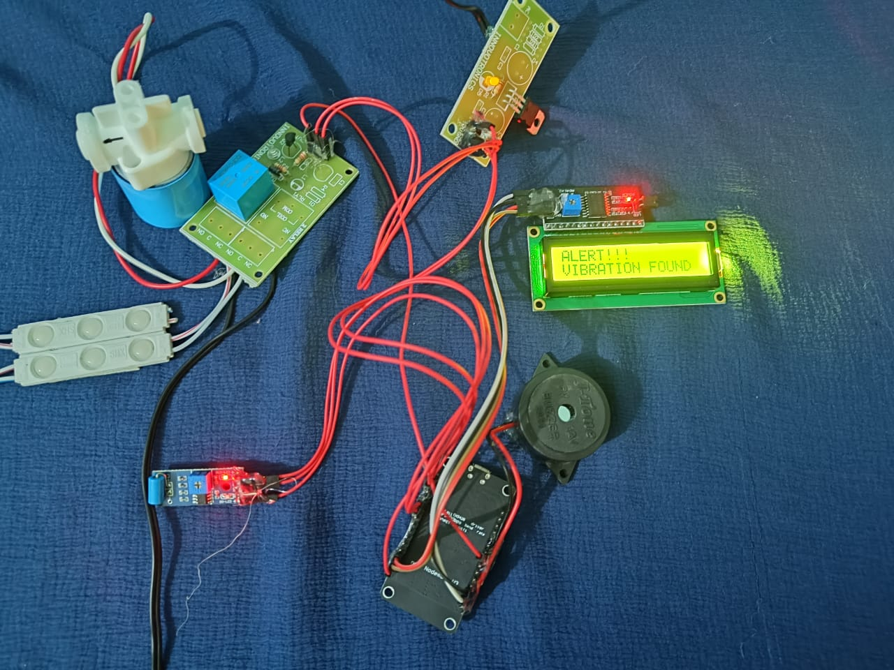
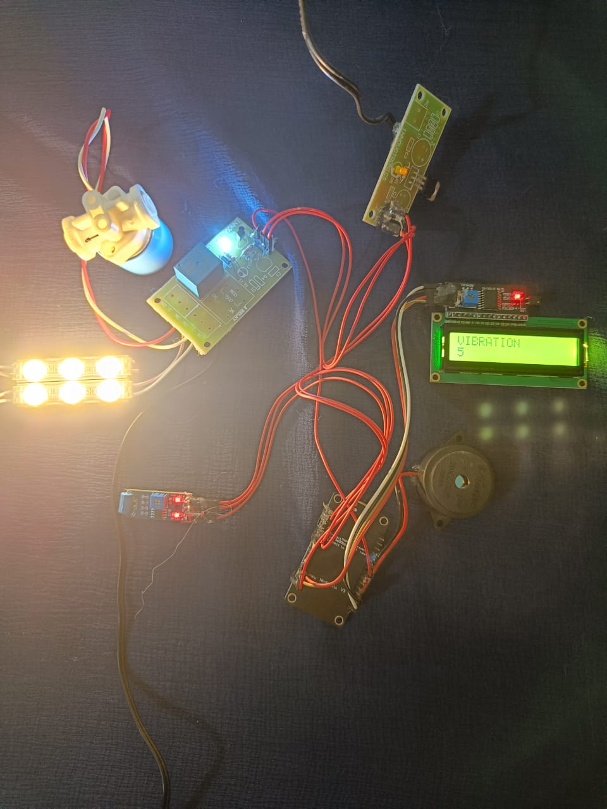
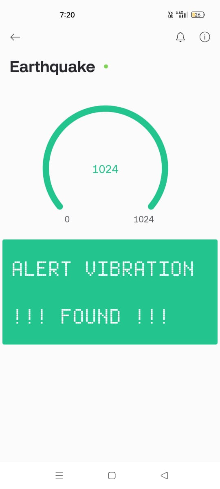
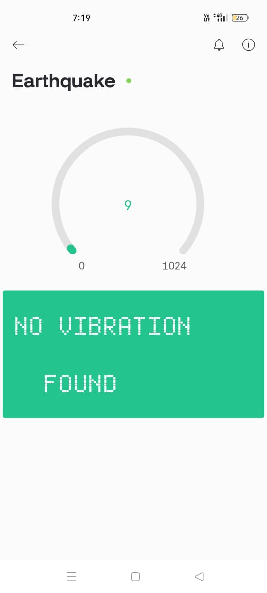

# Earthquake Monitoring & Alert System

An IoT-based real-time **Earthquake Monitoring System** using **ESP8266**, **SW-420 Vibration Sensor**, **Blynk**, and a **16x2 I2C LCD**. This project detects seismic activity and sends alerts via the Blynk app, along with visual and audible warnings through a buzzer, LED, and a solenoid gas valve controller.

## Developed By
**Gayathri G**  
GitHub: [GAYATHRI1006](https://github.com/GAYATHRI1006)

## Screenshot

  
  
  
  

## Components Used

- ESP8266 NodeMCU
- SW-420 Vibration Sensor
- 16x2 I2C LCD Display
- Buzzer
- LED
- Solenoid Gas Valve
- Blynk App
- Wi-Fi Connection


## How It Works

- The **SW-420 sensor** detects vibrations.
- If a vibration is detected, the system:
  - Triggers the **buzzer**
  - Turns **off the LED**
  - **Closes the solenoid gas valve**
  - Sends a **notification** to the user via Blynk
- The LCD displays status updates in real time.
- You can also manually control the buzzer and valve using Blynk.

## APIs and Libraries Used

### Blynk Cloud API
Used for mobile notifications and remote controls.

```cpp
#define BLYNK_TEMPLATE_ID "TMPL3fPEk8irW"
#define BLYNK_DEVICE_NAME "EarthquakeAlert"
#define BLYNK_AUTH "JRPi-rOLqwMYODjZ6wWfIzEKZS3SrnnA"
```
🔗 API Reference: [Blynk Cloud Platform](https://blynk.cloud/)

### Arduino Libraries

#include <Wire.h>
#include <LiquidCrystal_I2C.h>
#include <ESP8266WiFi.h>
#include <BlynkSimpleEsp8266.h>
Install these libraries from the Arduino Library Manager before uploading the code.

### Wi-Fi Credentials
Update your Wi-Fi details in the code:

#define WIFI_SSID "YourNetworkName"
#define WIFI_PASS "YourPassword"

### Sample Output

- LCD: "Earthquake Alert"
- Blynk: "Earthquake Alert! Take safety precautions."
- Buzzer: ON
- LED: OFF
- Solenoid Valve: CLOSED
